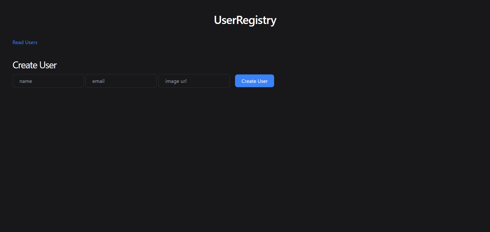
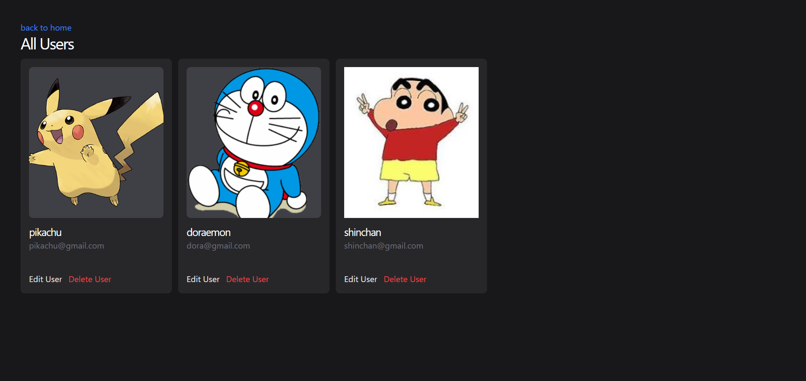

# 🚀 UserRegistry

A full-stack CRUD web application built using Node.js, Express.js, MongoDB, and EJS.
This project allows users to create, view, update, and delete user records through a simple and interactive web interface.

---

## ✨ Features

* ➕ Create new users
* 📄 View all users
* ✏️ Update existing users
* ❌ Delete users
* 🎯 Server-side rendering using EJS
* ⚡ Fast and responsive UI with Tailwind CSS

---

## 🛠️ Tech Stack

### 🔹 Backend

* Node.js
* Express.js

### 🔹 Database

* MongoDB
* Mongoose

### 🔹 Frontend

* EJS (Embedded JavaScript Templates)
* Tailwind CSS (CDN)

### 🔹 Tools

* VS Code
* MongoDB Compass
* Git & GitHub

---

## 📁 Project Structure

```
UserRegistry/
│
├── models/
│   └── indexmong.js
│
├── views/
│   ├── index.ejs
│   ├── read.ejs
│   └── edit.ejs
│
├── index.js
├── package.json
├── .gitignore
└── README.md
```

---

## ⚙️ Installation & Setup

### 1️⃣ Clone the repository

```bash
git clone https://github.com/yourusername/userRegistry.git
cd userRegistry
```

---

### 2️⃣ Install dependencies

```bash
npm install
```

---

### 3️⃣ Setup environment variables

Create a `.env` file in the root directory:

```env
MONGO_URI=your_mongodb_connection_string
```

---

### 4️⃣ Run the server

```bash
node index.js
```

---

### 5️⃣ Open in browser

```
http://localhost:3000
```

---

## 📸 Screenshots
```
> Add your screenshots here


```
---

## 📚 Concepts Covered

* CRUD Operations (Create, Read, Update, Delete)
* RESTful Routing
* Express Middleware
* MongoDB Integration with Mongoose
* Schema & Model Creation
* Server-side Rendering (EJS)
* Form Handling
* MVC Pattern (Basic Structure)

---

## 🚀 Future Improvements

* 🔐 Add JWT Authentication
* ✅ Form Validation
* 🎨 Improve UI/UX
* ☁️ Deploy on cloud (Render / Railway)

---

## 🤝 Contributing

Contributions are welcome! Feel free to fork this repo and submit a pull request.

---

## 📄 License

This project is open-source and available under the MIT License.

---

## 👨‍💻 Author

**Faham Khan**

---

⭐ If you like this project, don’t forget to star the repository!
